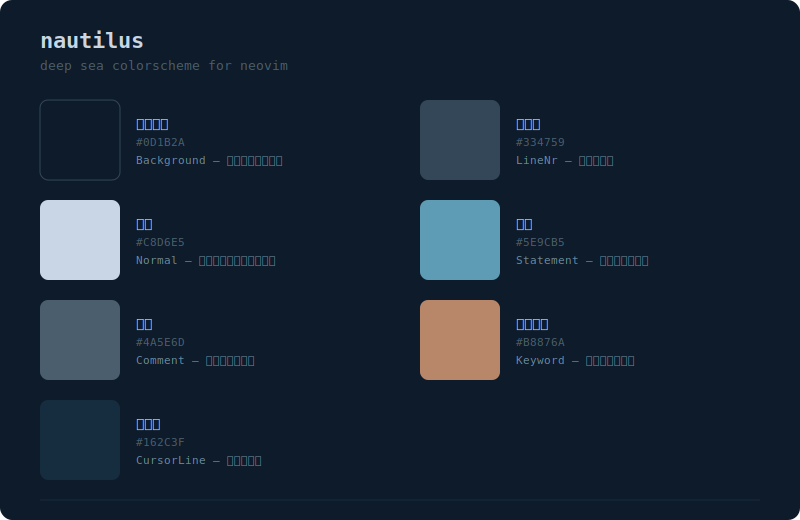

# 🐚nautilus

A deep sea colorscheme for Neovim, inspired by the nautilus dwelling in the abyss.

深海に棲むオウムガイをモチーフにした Neovim 用カラースキーム。

## Palette



## Installation

```lua
-- lazy.nvim
{
  "aidyak/nautilus",
  config = function()
    require("nautilus").setup({
      transparent = false,
    })
    vim.cmd("colorscheme nautilus")
  end,
}
```
